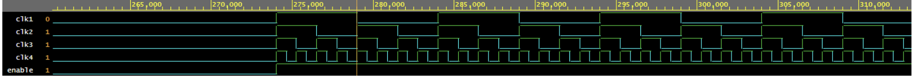
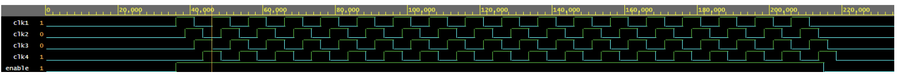
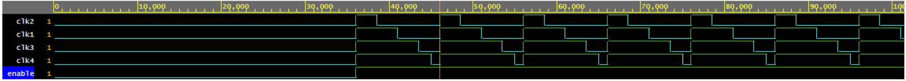

# ⏱️ Verilog Clock Generator (`clock.v`)

The **Clock Generator Module** is a **configurable Verilog module** designed to generate a clock signal with adjustable **frequency, phase shift, and duty cycle**. It is useful for testbenches, digital circuit simulations, and FPGA-based projects where precise clock control is required.

## 📌 Features  
- ✅ **Configurable Frequency** (in kHz)  
- ✅ **Adjustable Phase Shift** (in degrees)  
- ✅ **Customizable Duty Cycle** (in percentage)  
- ✅ **Enable/Disable Clock Control**  
- ✅ **Verilog Testbenches for Frequency, Phase, & Duty Cycle Variation**  

---

## 📖 **Project Overview**  

### 🛠️ **Clock Generation Mechanism**  
This module creates a **clock signal** by computing the clock period from the given **frequency** and using the **duty cycle** to determine ON/OFF states. Additionally, a **phase shift** can be introduced to synchronize the signal with other modules in a system.

### 🎛 **Configurable Parameters**  
The following parameters allow dynamic control of the clock behavior:  
- **`FREQ`** → Defines the clock frequency in **kHz**  
- **`PHASE`** → Controls the phase shift in **degrees**  
- **`DUTY`** → Determines the duty cycle (percentage of time the clock is HIGH)  

The clock starts when **enabled** and stops when disabled, making it adaptable for different test environments.

---

## 📊 **Clock Behavior Demonstration**  

### **1️⃣ Frequency Variation**  
The testbench modifies the `FREQ` parameter to observe the effect on clock timing.  

  

### **2️⃣ Phase Variation**  
The testbench adjusts the `PHASE` parameter to introduce a phase shift in the clock signal.  

  

### **3️⃣ Duty Cycle Variation**  
The testbench changes the `DUTY` parameter to vary the HIGH and LOW durations of the clock signal.  

  

---
